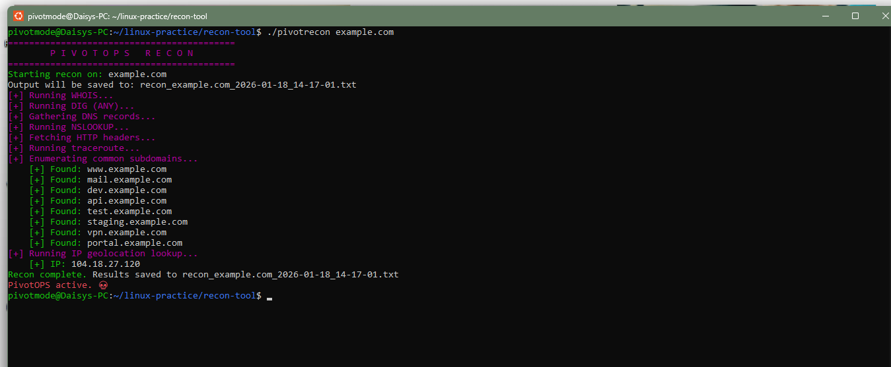

# 💀 PivotOPS Recon Toolkit  
A fast, modular Bash-based reconnaissance tool designed for practical OSINT, DNS enumeration, and network discovery. Built for clarity, speed, and real-world recon workflows.

---

## 🛠️ Skills Demonstrated
- Bash scripting  
- OSINT methodology  
- API usage  
- Network fundamentals  
- Tool documentation and version control  

---

## 💡 Branding: PivotOPS
PivotOPS is built around:
- Clear graphic execution  
- Proper design context  
- Practical recon  
- The mindset: **Just pivot.**  

---

## 🚀 Features
- WHOIS lookup  
- DNS record enumeration  
- Subdomain brute forcing (wordlist-based)  
- Multi-threaded report generation  
- HTTP header collection  
- SSL certificate inspection  
- IP geolocation lookup  
- Screenshot capture support  
- Clean, timestamped output logs  

---

## 📦 Installation
```bash
chmod +x pivotrecon
./pivotrecon example.com

--

## 🖼️ Demo Screenshot


💀 **PivotOPS in action. Just pivot.**

